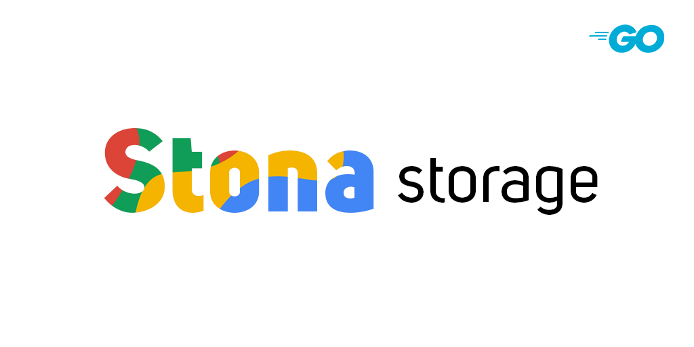

# Stona Storage

Stona is an API service that serves your files

## Usage

Stona has two way for installation. You can install it by follow the steps below when you decided installation.

- [Locally](###StandardInstallation)
- Docker ( No stable yet )

### Installation ( Locally )

- First of all, check your machine has golang, If it hasn't it you can find it [here](https://golang.org/)

- Clone this repository with git 

```sh
    git clone https://github.com/ali-furkqn/stona
    cd stona
```

- Download Dependencies

```sh
    make install
```

- Copy `.env.example` and paste it as `.env`, fill the fields

- Download [**Service account key**](https://console.cloud.google.com/apis/credentials/serviceaccountkey) as JSON and fill the env (special configuration file is going to adding soon. You won't need to fill env)

- Start the application
    - To start as development mode with hot reloading Use `make watch`
    - To start as production mode:
        - Build the application `make`
        - Start the generated binary file. For example `"./main"`

## License

Stona is [MIT licensed](LICENSE)
